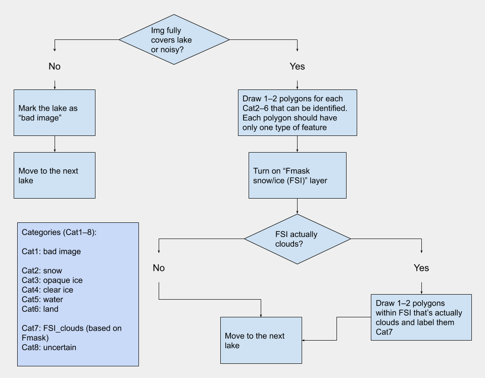

# Lake ice classification
Google Earth Engine interface to aid building training data for classifying ice formation on lake surfaces

## Setup the script
1. Open [this](https://code.earthengine.google.com/d66ba95022fff8935644da6c2229c234) GEE script in a new tab, and save the script to your own GEE repository;
2. run the script, and when the interface appears on the map, click on the "next" button to go to the first lake, or enter the lake index directly in the textbox to the right of the "next" button;
3. save frequently, and when you're done for the day, save the script first then export the data by running the script and initiate the task.

## Categories:

Class name|Description
---|---
Cat1. bad_image|add a polygon of this category if Landsat image does not fully cover the lake polygon or shown to have noise/artifacts on the image
Cat2. snow|lake surface covered by snow
Cat3. opaque_ice|lake surface covered by opaque ice
Cat4. clear_ice|lake surface covered by clear ice
Cat5. water|lake water surface
Cat6. land|land (island, bank area etc.)
Cat7. FSI_clouds|opaque or thin cloud covered lake surface where Fmask classifies as snow/ice
Cat8. uncertain|any situation where none of the above categories can be assigned over the entire lake

## Examples
